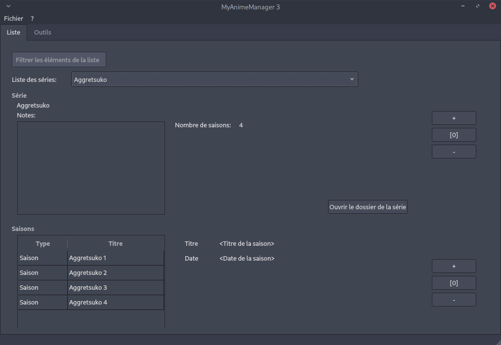

# MyAnimeManager 3

La continuation de MyAnimeManager1 et MyAnimeManager2.



Commencé en 2018.

## Dépendences
- python
- python-qt5
- peewee

## Migration des données de MyAnimeManager2 vers MyAnimeManager3
Pour migrer depuis la version 2, il est possible d'éxecuter un script qui va reprendre toutes les données et les migrer sur la nouvelle version:

```sh
python3 src/migrate_myanimemanager_v2_to_v3.py
```

Pour le moment, la configuration est à faire dans le fichier du script.

## Compilation / Empactage

### Archlinux / Manjaro

```sh
make archlinux-build
make manjaro-build
```
