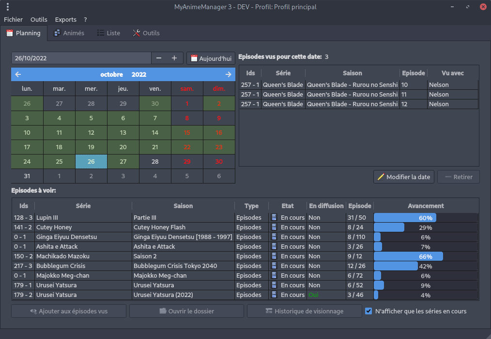

# MyAnimeManager 3

La continuation de MyAnimeManager1 et MyAnimeManager2.



Commencé en 2018.

## Dépendences
- python
- python-qt5
- peewee

## Lancement simple sans instalation

Après avoir cloné le dépot: on peut lancer la commande suivant pour disposer de thêmes supplémentaires. Elle n'est pas obligatoire:

```sh
git submodule update --init
```

Installer les dépendances suivantes:

- python
- python-qt5
- python-peewee

```sh
python3 src/MyAnimeManager3.py
```

## Compilation & Installation

### Archlinux / Manjaro

```sh
make archlinux-build
make archlinux-install
```

### Windows

Installer: git, nsis, Python3, PyInstaller (```pip install pyinstaller```)
Ensuite: ```pip install -r requirements.txt```

Depuis la racine du projet:
.\packaging\windows\build.bat
